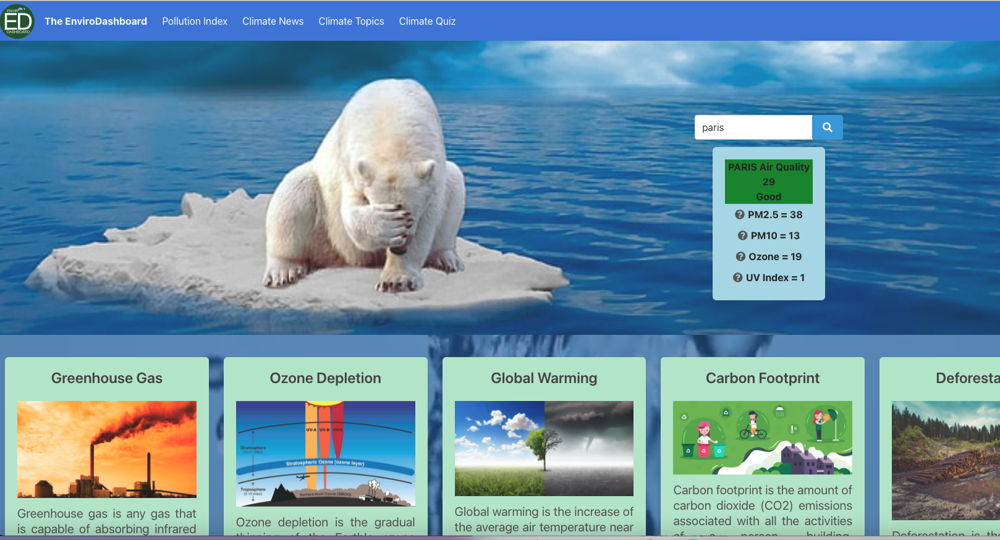
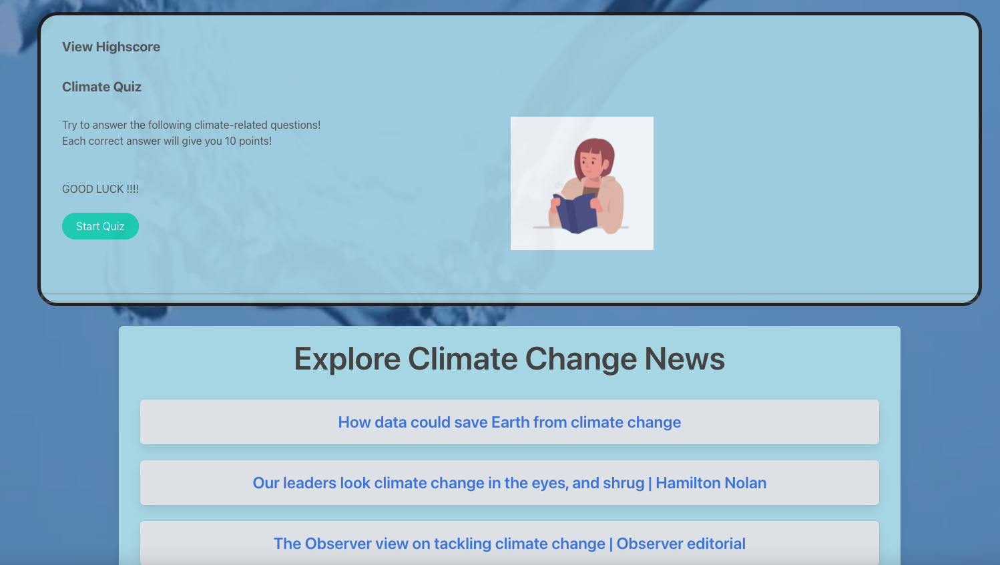

# enviro-dashboard

# Table of Contents

* [Introduction](#Introduction)
* [User Story](#User_Story)
* [Acceptance_Criteria](#Acceptance_Criteria)
* [Website Link](#Website)
* [GitHub Link](#GitHub)
* [Webpage Components](#Webpage_Components)
* [Technologies Used](#Technologies_Used)
* [Markup](#Markup)
* [Screenshots](#Screenshots)
* [Credits](#Credits)
* [License](#License)

#  Introduction
This webpage provides information about the effects of climate change in the world. The user will enter the name of their city in the search field. After clicking the submit button, the user will be presented with relevant climate information in the form of pollution widget. The user can also interact with a simple quiz with randomly generated questions about climate change, to test their current knowledge of the subject. The user can take the quiz as many times as possible. The news articles related to climate change from the Guardian are populated upon loading of page.

# User_Story
AS a concerned environmentalist,
I WANT to visit a page for information regarding climate change
SO I CAN learn more about a variety of important topics related to such.

# Acceptance_Criteria
GIVEN a webpage featuring climate change information with form inputs and a quiz
WHEN I open the webpage
THEN I am presented with articles and data related to climate change
WHEN I search for a location
THEN I am presented with information pertaining to local air pollution 
WHEN I click a button to start a quiz on climate change
THEN the questions are presented in random order
WHEN the quiz is completed
THEN the score is given and the leaderboard is displayed.

# Website
## [enviro-dashboard](https://theteam33333.github.io/enviro-dashboard/)

# GitHub 
## [GitHub Repo](https://github.com/theteam33333/enviro-dashboard/)
# Webpage_Components
* Welcome page 
* HTML Skeleton
* A quiz featuring local storage high score system
* API call for pollution widget
* API call for pulling news articles
* An input search field

# Technologies_Used
* HTML
* CSS
* JavaScript
* BULMA Framework
* jQuery

# Markup

# Screenshots

# Credits: 
* Craig Martin
* Colin Nebula
* Harvinder(Harry)Shah
* Micheal Mifsud
* Sumant Singh

# License: 
* MIT